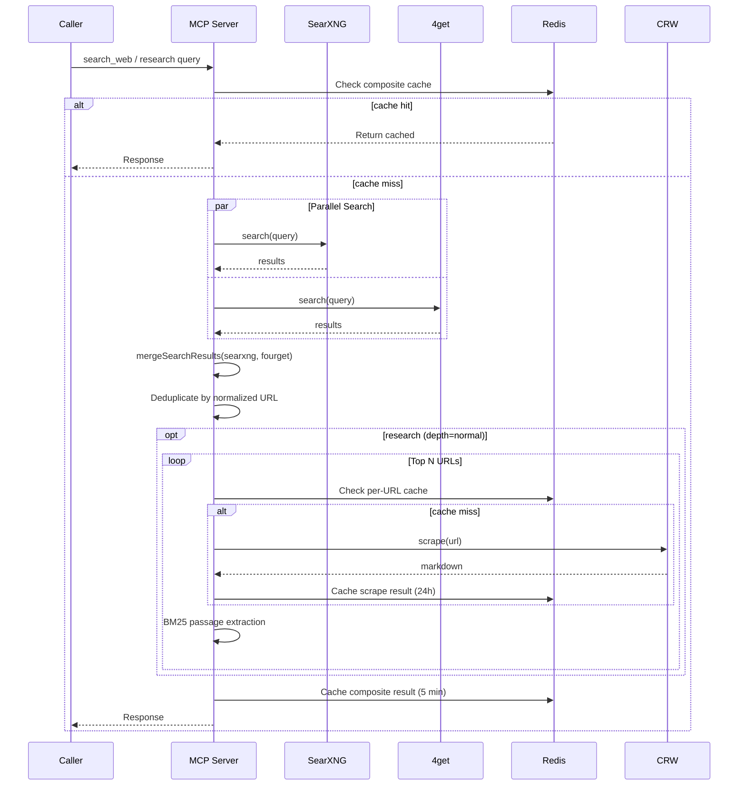

# Design: 4get Search Integration

**Date:** 2026-07-10
**Status:** Draft
**Author:** Axiom (Planner)

## Problem Statement

The MCP server's search pipeline uses SearXNG as its sole search source. Adding 4get as a parallel, independent search source increases coverage, diversity, and resilience — while routing all results through the existing CRW scraping and BM25 passage extraction pipeline.

## Chosen Approach: 4get as Parallel Source, Merged at Search Layer

4get is called in parallel with SearXNG for every search. Results from both sources are merged by normalized URL (deduplication), and the unified result set flows downstream into CRW scraping and BM25 extraction just as SearXNG-only results do today.

**Justification:**
- **Minimal change surface.** The merge happens at the search layer — handlers that consume search results (CRW scrape, BM25) are unchanged.
- **Graceful degradation.** 4get is supplemental. If it fails or times out, SearXNG results are used alone.
- **Shared dedup logic.** A single `mergeSearchResults()` function is used by all three handlers (`search_web`, `search_and_scrape`, `research`), avoiding duplication.
- **Independent caching.** 4get search results are cached separately from SearXNG, so cache invalidation is independent per source.

## Alternatives Considered

### A: 4get as SearXNG Engine
Configure 4get as an additional engine *within* SearXNG. Rejected: 4get is itself a metasearch aggregator, not a single-engine source. Running it through SearXNG adds unnecessary indirection and latency. Direct parallel calls are simpler and give us independent failure domains.

### B: 4get as Drop-In Replacement for SearXNG
Replace SearXNG entirely. Rejected: SearXNG is proven, highly configurable, and deeply integrated. 4get augments it — it doesn't replace it.

### C: 4get Only in search_web (Snippets Only)
Merge at the snippet layer only; research pipeline stays SearXNG-only. Rejected: fails to meet the stated requirement of routing 4get results through CRW → BM25.

## Architecture

### Component Diagram

```
                         ┌─────────────────────────┐
                         │     MCP Server (index)   │
                         │                         │
  query ────────────────▶│  handleSearchWeb()       │
                         │  handleResearch()         │
                         │  handleSearchAndScrape()  │
                         │       │                   │
                         │       ├── mergeSearchResults()
                         │       │                   │
                         │       ▼                   │
                         │  ┌──────────┐  ┌────────┐ │
                         │  │SearXNG   │  │4get    │ │
                         │  │Client    │  │Client  │ │
                         │  └────┬─────┘  └───┬────┘ │
                         │       │             │      │
                         └───────┼─────────────┼──────┘
                                 │             │
                    ┌────────────▼──┐  ┌───────▼────────┐
                    │  SearXNG      │  │  4get container │
                    │  :8081        │  │  :80 (internal) │
                    └───────────────┘  └────────────────┘
                                 │             │
                                 └──────┬──────┘
                                        │ merged URLs
                                        ▼
                                 ┌──────────────┐
                                 │  CRW :8001   │
                                 │  (scrape)    │
                                 └──────┬───────┘
                                        │ markdown
                                        ▼
                                 ┌──────────────┐
                                 │  BM25        │
                                 │  Extraction  │
                                 └──────────────┘
```

### Data Flow (Mermaid)



### API Contracts

**FourgetClient (new):**

```typescript
class FourgetClient {
  constructor(baseUrl: string)
  search(query: string, scraper?: string): Promise<FourgetSearchResponse>
  healthCheck(): Promise<boolean>
}

interface FourgetSearchResponse {
  status: string;          // "ok" on success
  web: FourgetResult[];
  answer: any[];
  npt: string;             // next-page token
}

interface FourgetResult {
  title: string;
  url: string;
  description: string;     // Flattened from rich-text array
  date: number | null;     // Unix timestamp
  type: string;
}
```

**mergeSearchResults (new):**

```typescript
interface UnifiedResult {
  title: string;
  url: string;
  content: string;         // Snippet (from either source)
  publishedDate?: string;  // ISO string
  source: 'searxng' | 'fourget' | 'both';
  searxngScore?: number;
}

function mergeSearchResults(
  searxngResults: SearchResult[],
  fourgetResults: FourgetResult[],
  options?: { maxResults?: number }
): UnifiedResult[]
```

**No changes to existing API contracts.** Response shapes remain identical.

## Key Design Decisions

### 1. 4get Description Flattening

4get returns `description` as a structured array:
```json
[
  {"type": "text", "value": "Some text "},
  {"type": "inline_code", "value": "SELECT 1"},
  {"type": "text", "value": " more text"}
]
```

The `FourgetClient.search()` method flattens this to a plain string by concatenating `.value` fields. This preserves readability while matching SearXNG's flat `content` field format.

### 2. URL Deduplication Strategy

- Normalize URLs from both sources using the existing `normalizeUrl()` function (strips tracking params, lowercases, etc.)
- Build a `Map<normalizedUrl, UnifiedResult>`
- When both sources produce the same URL:
  - Use the result with the longer snippet/content as the primary
  - Mark source as `'both'`
  - Preserve SearXNG score if available

### 3. Result Ordering

Results are interleaved: SearXNG results first (preserving their relevance order), then 4get-only results appended. This maintains SearXNG as the "primary" source in ordering while ensuring 4get results are visible.

### 4. Caching Strategy

| Cache Key Pattern | TTL | Content |
|---|---|---|
| `fourget:search:{query}:{scraper}` | `MCP_FOURGET_CACHE_TTL_MS` (default 300s) | Raw 4get response |
| `search:merged:{query}:{categories}:{engines}:{language}:{scraper}` | `MCP_SEARCH_CACHE_TTL_MS` (default 300s) | Merged + shaped response |
| `research:{query}:{depth}:{breadth}:{...}:{contentMode}:{scraper}` | `MCP_COMPOSITE_CACHE_TTL_MS` (default 300s) | Full research response |

The `scraper` parameter (default `"brave"`) is included in cache keys to prevent cache poisoning across different scraper configurations.

### 5. Error Handling

4get is treated as **supplemental** — its failure never prevents SearXNG from returning results.

- Use `Promise.allSettled` for parallel calls
- If 4get fails: log warning, return SearXNG-only results, mark source metadata
- If SearXNG fails but 4get succeeds: return 4get results (better than nothing)
- If both fail: return error as before
- 4get timeout: 8s (slightly less than SearXNG's 10s to avoid holding up the pipeline)

### 6. Docker Networking

4get is added as a service in the existing `docker-compose.yml` on the `search-net` network. No host port mapping needed since the MCP server communicates with it internally. Environment variable `FOURGET_URL` configures the endpoint.

## Risks and Mitigations

| Risk | Severity | Mitigation |
|---|---|---|
| 4get returns very different result quality from SearXNG | Medium | Interleave with SearXNG results first; quality will become apparent in usage |
| 4get unavailable or slow | Low | `Promise.allSettled` with timeout; falls back to SearXNG-only |
| Cache key explosion (new scraper dimension) | Low | Composite keys include scraper; same TTL enforcement |
| 4get description format changes | Low | Flattening is defensive — any `{value: string}` is concatenated; other shapes are skipped |
| Merge logic introduces ordering bias | Low | SearXNG-first ordering is conservative; can be tuned later |
| 4get running on different docker-compose than MCP server | Low | Add 4get to the MCP's docker-compose on search-net; keep infra/4get/docker-compose.yml for standalone use |

## Files Summary

| File | Action | Purpose |
|---|---|---|
| `src/fourget-client.ts` | CREATE | 4get API client |
| `src/search-merger.ts` | CREATE | URL dedup + merge logic |
| `src/index.ts` | MODIFY | Wire FourgetClient, call merge in handlers |
| `docker-compose.yml` | MODIFY | Add 4get service + FOURGET_URL env |
| `tests/fourget-client.test.ts` | CREATE | 4get client unit tests |
| `tests/search-merger.test.ts` | CREATE | Merger unit tests |
